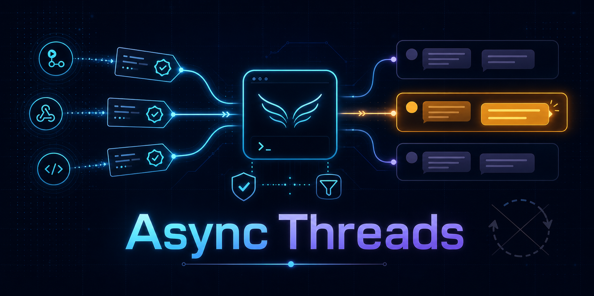
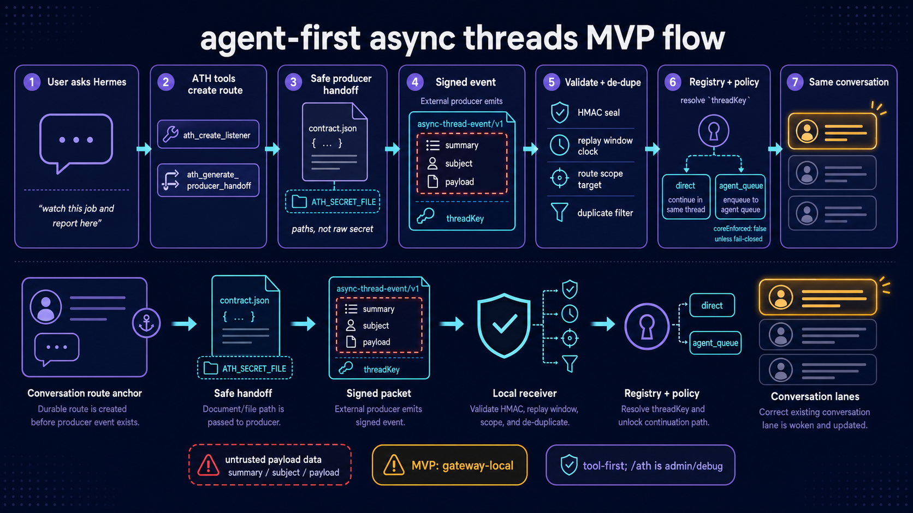

# hermes-plugin-async-threads



> Event-driven wakeups for existing Hermes gateway conversations, without cron polling.

`hermes-plugin-async-threads` lets an external producer send a signed event to Hermes and target an existing conversation handle. Hermes validates the event, de-dupes it, resolves the registered async-thread handle, and either posts a direct notification or queues an agent continuation with explicit policy metadata for the same gateway session. Current Hermes core does not expose plugin-local hard caps for those continuation limits, so strict hard-bound requirements should opt into fail-closed mode until that core seam exists.

## Current status

This repository is an MVP. It is useful, but it is not a blanket promise that every Hermes runtime can be resumed from every producer yet.

| Surface | Status |
| --- | --- |
| Discord gateway sessions | Unit-tested dispatch path with mock adapter; live gateway smoke pending |
| Telegram gateway sessions | Metadata helper covered for DM/topic routing; live gateway smoke pending |
| Slack gateway sessions | Generic thread metadata covered; live gateway smoke pending |
| Other gateway adapters | Intended, unverified |
| CLI | Producer helper only; no `listen here` listener UX |
| Hermes Desktop/API server | Unverified |
| Multi-gateway or multi-profile routing | Unsupported in the MVP; receiver assumes the target adapter is connected in the same gateway process/profile |

Known technical debt is tracked in the public-release readiness epic: https://github.com/donovan-yohan/hermes-plugin-async-threads/issues/33

## What problem does this solve?

Hermes can already run in gateway conversations and scheduled jobs can deliver back to an origin. The awkward workaround for long-running external work is a watcher or cron job that repeatedly polls until something changes.

Async threads invert that. The external system emits a signed event only when something meaningful happens, and Hermes wakes the mapped conversation.

Good fits:

- CI or deploy jobs reporting completion;
- long-running local scripts or background agents;
- GitHub or repository automation;
- home automation alerts;
- workflow/control-plane systems that should notify or resume a Hermes conversation without learning chat-platform APIs.

## How it works



The diagram above is intentionally scoped to the current MVP: gateway-local dispatch, dispatch paths covered with mock adapter tests, and producer payload boxed as untrusted data.

1. A user asks Hermes from an existing gateway conversation to watch/report on long-running work.
2. Hermes uses the model-facing ATH tools to create or reuse a listener and generate a safe producer handoff. Power users can do the same setup manually with `/ath listen`.
3. The plugin stores a durable `threadKey`, the captured Hermes `SessionSource`, allowed producer/event scope, policy, and a per-handle HMAC secret.
4. A producer sends `async-thread-event/v1` JSON to `POST /async-threads/v1/events` and signs the exact request body.
5. The receiver validates timestamp, route scope, HMAC, and de-dupe state.
6. Policy chooses either direct delivery or `agent_queue` continuation.
7. Event summary, subject, and payload are rendered as untrusted data before entering the agent session.

## Quickstart

See [`docs/QUICKSTART.md`](docs/QUICKSTART.md) for install/config and a complete agent-first signed demo workflow. See [`docs/EVENT_CONTRACT.md`](docs/EVENT_CONTRACT.md) for the producer-facing event contract and JSON Schema. See [`docs/BRIDGE_RECIPES.md`](docs/BRIDGE_RECIPES.md) for task-board bridge, emit-command, lifecycle, supersession, trace, and prune recipes. See [`skills/async-thread-agent-tools/SKILL.md`](skills/async-thread-agent-tools/SKILL.md) for the reusable Hermes agent skill.

Normal user ask:

```text
watch this demo job and report back here when it finishes
```

Expected agent path:

1. call `ath_create_listener` for the current conversation;
2. call `ath_generate_producer_handoff` for the producer;
3. give the producer `ATH_SECRET_FILE`/contract paths, not the raw secret;
4. verify the signed event with `ath_trace_event` or `/ath trace`.

Manual `/ath listen` remains available for power users and debugging:

```text
/ath listen demo --events demo.job.finished --ack brief
```

Minimal event envelope, matching the [`async-thread-event/v1` contract](docs/EVENT_CONTRACT.md):

```json
{
  "version": "async-thread-event/v1",
  "eventId": "demo-001",
  "eventType": "demo.job.finished",
  "producer": {"id": "demo"},
  "occurredAt": "2026-06-20T19:00:00Z",
  "asyncThread": {"threadKey": "ath_..."},
  "summary": "demo job finished",
  "payload": {"status": "passed", "artifact": "build-123"}
}
```

Sign the exact JSON request body with:

```text
X-Hermes-Signature-256: sha256=<hmac_sha256_hex(body, secret)>
```

## Security model

- Producers must authenticate with per-handle HMAC-SHA256 secrets.
- Events include timestamps and are rejected outside the replay window.
- Events are de-duped by producer/event id.
- Producers are scoped by listener handle and optional allowed event types.
- Payload text is data, not a user instruction.
- Raw logs/transcripts should not be placed in event payloads; use compact state and log paths.
- The MVP stores per-handle HMAC secrets in plugin-local SQLite because the receiver needs to validate inbound events.
- Listener creation writes a producer-facing `secret.txt` and `contract.json` under the Hermes profile data directory with restrictive permissions where supported; command/tool output shows paths, not the raw secret.

See [`docs/SECURITY.md`](docs/SECURITY.md) for more detail.

## Current implementation features

- plugin-local SQLite async-thread registry;
- model-facing tools for listener creation, inspection, retirement, tracing, and producer handoff generation;
- `/ath listen/list/inspect/status/events/trace/workflows/emit-command/rotate-secret/lifecycle/prune/pause/resume/retire/revoke` gateway commands for manual admin/debug;
- `async_threads` gateway platform receiver;
- signed `async-thread-event/v1` HTTP endpoint;
- de-dupe by producer/event id;
- idle-session wake and active-session queue behavior;
- privacy-safe dispatch diagnostics;
- opt-in `agent_queue` acknowledgements;
- compact long-running event rendering with `tailMode: none | compact | debug`;
- optional debounce/coalescing for routine same-thread updates;
- generic workflow-stage/candidate/evidence tracking with serial/parallel gate policy;
- terminal-event lifecycle policy for warning on stale enabled listeners or auto-retiring single-goal listeners after successful terminal delivery;
- explicit agent-queue continuation policy metadata, with fail-closed mode when hard Hermes core bounds are required;
- producer helper script for compact background-lane events;
- model-facing producer handoff generation for generic contracts, local emitter files, GitHub Actions recipes, and explicit debug emitters;
- benchmarkable synthetic agent-tool scenarios for PR review lanes, local long jobs, external producers, and debug/admin workflows.

## Known limitations

- Gateway-local MVP: dispatch assumes the target platform adapter is connected in the same gateway process/profile.
- Non-Discord routing has unit coverage for shared send metadata, Telegram DM/topic metadata, and Slack-style generic thread metadata; live gateway smokes are still pending.
- Direct delivery, acknowledgement, and command notices share a centralized send-metadata helper, but the helper still wraps a private Hermes gateway function until the [stable continuation API](docs/design/STABLE_CONTINUATION_API.md) lands.
- Active-session queueing currently relies on Hermes gateway/adapter internals; the continuation API spike names the smallest core seam to remove that coupling.
- CLI and Hermes Desktop cannot create a listener from “here” yet; listener creation needs a live gateway origin, and no-source contexts fail closed.

## Development

The repo is a Hermes plugin, not a standalone bot. Tests need Hermes gateway modules available. The local test harness auto-detects a sibling or profile-local Hermes checkout when present; set `HERMES_AGENT_PATH=/path/to/hermes-agent` if needed.

```bash
uv run pytest -q
```

## License

MIT — see [`LICENSE`](LICENSE).
