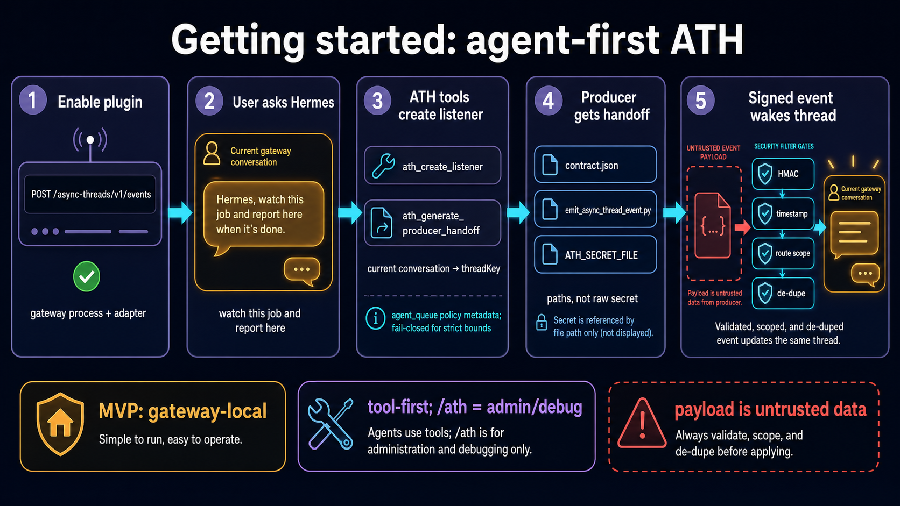

# Getting started: agent-first async-thread wakeups

This quickstart exercises the current gateway-local MVP. It assumes a Hermes gateway process is running with the target platform adapter connected in the same profile/process as the `async_threads` receiver.



## What this proves

By the end, you should have verified the default public workflow:

1. a user asks Hermes naturally from the conversation that should be woken later;
2. Hermes uses model-facing ATH tools to create a listener and producer handoff;
3. the producer signs one compact event with the generated secret-file reference;
4. ATH validates, de-dupes, and routes the event back to the same mapped gateway conversation.

Manual `/ath` commands are still available for operators, but the happy path is agent tools first.

## Prerequisites

- Hermes Agent with gateway plugin support.
- This plugin installed in the active Hermes profile.
- `aiohttp` available in the Hermes runtime environment.
- A supported gateway conversation where Hermes can resolve the current origin. The tested MVP path is Discord-shaped gateway sessions.

## Enable the plugin

For a source checkout/directory install, copy or clone this repository into the active Hermes profile's plugin directory so the plugin directory contains both `plugin.yaml` and root `__init__.py`. Then enable the plugin and platform adapter in the profile config.

The project also declares a `hermes_agent.plugins` entry point for packaged installs, but source checkout/copy is the most explicit path until a published package exists.

```yaml
plugins:
  enabled:
    - async-threads

platforms:
  async_threads:
    enabled: true
    extra:
      host: "127.0.0.1"
      port: 8765
      # Optional when exposing through a reverse proxy:
      # public_url: "https://example.com"
      # Optional explicit registry path:
      # registry_path: "/absolute/path/to/registry.sqlite3"
```

Restart the Hermes gateway after plugin/config changes. Plugins are loaded during gateway startup.

Verify the receiver is reachable:

```bash
curl -fsS http://127.0.0.1:8765/async-threads/v1/health
```

Expected shape:

```json
{"ok": true, "platform": "async_threads"}
```

## Agent happy path: ask Hermes to watch and report here

From the gateway conversation you want to wake later, ask Hermes naturally:

```text
watch this demo async job and report back here when it finishes
```

The agent should use the model-facing ATH tools instead of making you learn `/ath listen` flags:

1. `ath_create_listener` with a stable producer id such as `demo`, narrow event kinds such as `finished`, and the current conversation as the target.
2. `ath_generate_producer_handoff` with `mode: local_script`, `github_actions`, or `generic_contract` depending on the producer.
3. Give the producer the generated `contractFile`, helper file, or `ATH_SECRET_FILE` path. The raw HMAC secret is not printed in normal tool output.
4. Verify delivery with `ath_trace_event` or `/ath trace <event_id>`.

Typical listener creation intent:

```json
{
  "purpose": "watch this demo async job and report back here when it finishes",
  "producer_hint": "demo",
  "event_kinds": ["finished", "failed"],
  "delivery": "agent_queue",
  "target": "current_conversation",
  "max_turns": 1,
  "max_tool_calls": 0,
  "timeout_seconds": 120
}
```

Typical handoff intent:

```json
{
  "thread_key": "ath_...",
  "mode": "local_script"
}
```

A successful listener/handoff gives the agent producer-safe references such as:

- `threadKey`
- receiver URL
- `secretFile` path
- `contractFile` path
- optional helper/emitter file path

Save the `threadKey` and pass the `secretFile` path to the producer through a local secret manager, mounted file, or `ATH_SECRET_FILE`. The generated `secret.txt` is written without a trailing newline, so producer examples read the file text directly. The raw secret is not printed in normal command/tool output.

## Send a signed demo event

Replace the environment variables with values from the tool-created listener/handoff.

```bash
export ATH_URL="http://127.0.0.1:8765/async-threads/v1/events"
export ATH_THREAD_KEY="ath_..."
export ATH_SECRET_FILE="/path/from/handoff/secret.txt"

python3 - <<'PY'
import hashlib
import hmac
import json
import os
import time
import urllib.request

url = os.environ["ATH_URL"]
thread_key = os.environ["ATH_THREAD_KEY"]
secret = open(os.environ["ATH_SECRET_FILE"], encoding="utf-8").read()

body = {
    "version": "async-thread-event/v1",
    "eventId": f"demo-{int(time.time())}",
    "eventType": "demo.job.finished",
    "producer": {"id": "demo"},
    "occurredAt": time.strftime("%Y-%m-%dT%H:%M:%SZ", time.gmtime()),
    "asyncThread": {"threadKey": thread_key},
    "summary": "demo job finished",
    "payload": {"status": "passed", "artifact": "build-123"},
}
raw = json.dumps(body, sort_keys=True, separators=(",", ":")).encode("utf-8")
signature = hmac.new(secret.encode("utf-8"), raw, hashlib.sha256).hexdigest()
request = urllib.request.Request(
    url,
    data=raw,
    method="POST",
    headers={
        "Content-Type": "application/json",
        "X-Hermes-Signature-256": f"sha256={signature}",
    },
)
with urllib.request.urlopen(request, timeout=20) as response:
    print(response.status)
    print(response.read().decode("utf-8", "replace"))
PY
```

Expected successful response:

- `202` with `{"status":"accepted", ...}` for idle `agent_queue` continuation;
- `202` with `{"status":"queued", ...}` if the target session is currently active or the event is inside a coalescing window;
- `200` with `{"status":"delivered", ...}` for direct-delivery listeners.

With `ack: brief`, the mapped gateway conversation should also receive a compact visible acknowledgement before the continuation is handed off or queued.

## Verify and debug

Use model tools first when you are in an agent session:

- `ath_trace_event` — inspect one event's delivery/de-dupe path.
- `ath_get_listener` — inspect one listener without exposing secrets.
- `ath_list_listeners` — list listeners scoped to the current owner/conversation.
- `ath_retire_listener` — disable a listener and clean up producer-facing secret files.

Manual `/ath` commands are the equivalent admin/debug surface for gateway operators:

```text
/ath status
/ath list
/ath events [thread_key] [--limit N]
/ath trace <event_id> [--json]
/ath workflows [thread_key] [--limit N]
/ath inspect <thread_key>
/ath emit-command <thread_key> --event event.type [--summary text]
/ath rotate-secret <thread_key>
/ath lifecycle [thread_key]
/ath prune [--dry-run|--force] [--event-log-days N] [--seen-days N]
/ath pause <thread_key>
/ath resume <thread_key>
/ath retire <thread_key>
/ath revoke <thread_key>
```

## Event fields

This section shows the short version. The complete producer-facing contract is [`EVENT_CONTRACT.md`](EVENT_CONTRACT.md), with a permissive JSON Schema at [`schemas/async-thread-event-v1.schema.json`](schemas/async-thread-event-v1.schema.json). Bridge and operator recipes live in [`BRIDGE_RECIPES.md`](BRIDGE_RECIPES.md).

Required fields:

```json
{
  "version": "async-thread-event/v1",
  "eventId": "stable-id-from-producer",
  "eventType": "demo.job.finished",
  "producer": {"id": "demo"},
  "occurredAt": "2026-06-20T19:00:00Z",
  "asyncThread": {"threadKey": "ath_..."}
}
```

Recommended fields:

- `summary`: short human-readable status.
- `subject`: compact routing/subject metadata.
- `payload`: compact producer-specific data.
- `tailMode`: `compact`, `none`, or `debug`.
- `workflowId`, `stage`, `artifact`, `candidate`, `evidence`: optional workflow-state fields.
- `seriesKey`, `supersedesEventId`, and `artifact.revision`: optional repeated-artifact/stale-event convention fields.

Payload text is untrusted data. Do not put raw logs, transcripts, secrets, terminal bytes, or user-authored instructions in event payloads. Use the bridge/generator checklist in [`EVENT_CONTRACT.md`](EVENT_CONTRACT.md) when building a producer.

## Compact long-running event pattern

For long-running jobs or background agent lanes, prefer sparse state transitions:

```json
{
  "version": "async-thread-event/v1",
  "eventId": "job-123-finished",
  "eventType": "job.finished",
  "producer": {"id": "demo"},
  "occurredAt": "2026-06-20T19:00:00Z",
  "asyncThread": {"threadKey": "ath_..."},
  "summary": "job finished and is ready for review",
  "tailMode": "compact",
  "subject": {"job": "job-123", "log_path": "/tmp/job-123.log"},
  "payload": {"status": "passed", "verification": "tests passed"}
}
```

Use `tailMode: debug` only for explicit debugging. Debug tails are redacted and capped, but compact state plus a log path is safer for routine events.

## Current limitations

- Listener creation needs a resolvable live gateway origin. Model tools handle this from a supported gateway conversation; CLI/Desktop/no-source contexts fail closed instead of guessing a destination.
- The receiver assumes the target platform adapter is connected in the same gateway process/profile.
- Non-Discord gateway support is intended but needs compatibility tests.
- Direct-delivery routing metadata still needs a stable platform-aware continuation helper.
